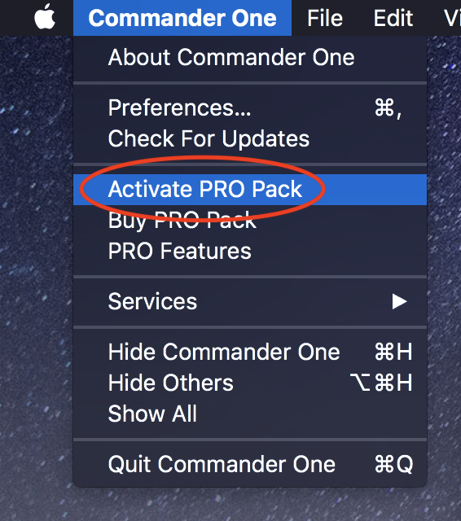
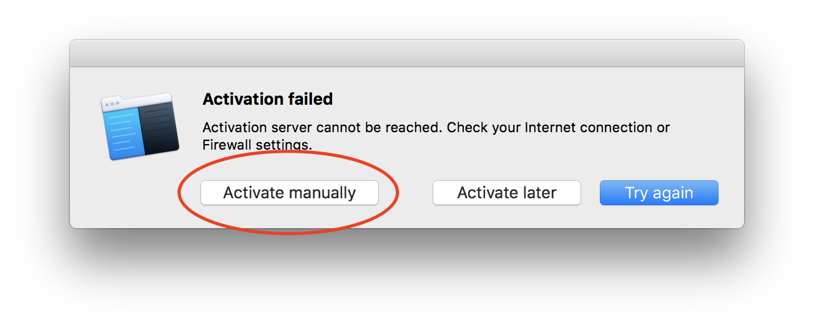
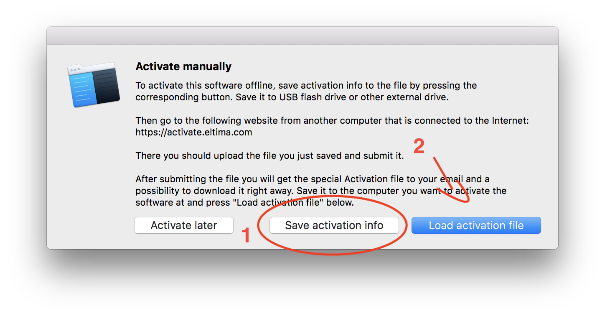

# CommanderOne keygen

## 1. How to build

  * Before you build keygen, you should make sure you have installed OpenSSL.

    If you have brew, you can install it by `brew install openssl`.

    ```bash
    $ cd keygen
    $ make release
    ```

  * Build patcher

    ```bash
    $ cd patcher
    $ make release
    ```

## 2. How to use

  1. Build keygen and patcher.

  2. Run patcher:

     ```bash
     $ cd patcher
     $ ./patcher <your CommanderOne executable file path>
     ```

     Example:

     ```bash
     $ cd patcher
     $ ./patcher /Applications/Commander\ One.app/Contents/MacOS/Commander\ One
     ```

  3. If necessary, generate a self-signed code-sign certificate and always trust it. Then use `codesign` to re-sign `Commander One.app`.

     ```bash
     $ codesign -f -s "Your self-signed code-sign certificate name" <path to Commander One.app>
     ```

  4. Then goto `keygen` folder and in Terminal:

     ```bash
     $ ./keygen privatekey
     ```

     You will get an activation code and be asked to input your name and license name.

     Just input whatever you want and then you will be asked to input the activation info. Now DO NOT CLOSE KEYGEN.

  5. Disconnect network and open `Commander One.app`. Find and click `Activate PRO Pack`.

     

     Then input activation code that keygen gave and click `Activate`.

  6. Generally, online activation would failed. But it doesn't matter. Click `Activate manually`.

     

  7. Then you will see

     

     Click `Save activation info` first and save the file. Then use `TextEdit.app` open the file you just save. Copy the file's content and paste it into keygen. Press `Enter` and the keygen would generate a file named `license.bin` in current folder (`pwd`).

  8. Finally, click `Load activation file` and select `license.bin`. If nothing wrong, activation should be done successfully. 
